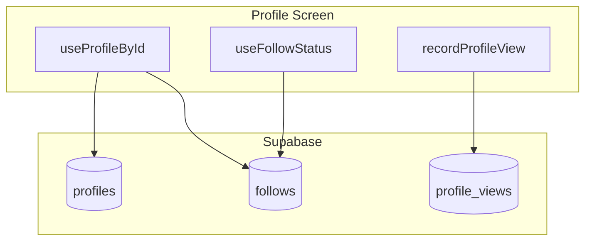

# Slice 02 — Profiles + Social Implementation Plan

**Implementation order:** 1) Run schema SQL in Supabase SQL Editor. 2) Implement types, libs, hooks, screens, then navigation. 3) Update slice status and run `/verify`.

---

## Target

[slices/02-profiles-social.md](slices/02-profiles-social.md) — Status: TODO

## Current State

- **Profiles**: Table exists with `id`, `role`, `display_name`, `bio`, `location`, `avatar_url`, etc. Public SELECT policy "Profiles are viewable by everyone" (qual `true`) allows discovery. [docs/schema-profiles.sql](docs/schema-profiles.sql) adds `display_name`, `bio`, `location`.
- **Storage**: `avatars` bucket exists, public, used by [src/lib/avatars.ts](src/lib/avatars.ts).
- **Auth store**: `updateProfile`, `fetchProfile` exist. Profile edit form logic lives in [app/onboarding/profile-setup.tsx](app/onboarding/profile-setup.tsx).
- **Routes**: No profile routes yet. Role homes at `(player)/home`, `(scout)/home`, etc.
- **UI**: Shared `Screen`, `Button`, `Input`, `Text` in [src/components/ui/](src/components/ui/).

---

## 1. Schema and RLS

Create `docs/schema-02-profiles-social.sql`.

**Pre-requisite:** `profiles` has public SELECT policy "Profiles are viewable by everyone" — no changes needed.

```sql
-- follows: follower_id, followee_id, created_at
CREATE TABLE IF NOT EXISTS follows (
  follower_id uuid REFERENCES auth.users(id) ON DELETE CASCADE,
  followee_id uuid REFERENCES auth.users(id) ON DELETE CASCADE,
  created_at timestamptz DEFAULT now(),
  PRIMARY KEY (follower_id, followee_id),
  CHECK (follower_id != followee_id)
);

-- profile_views: viewer_id (nullable), profile_id, created_at
CREATE TABLE IF NOT EXISTS profile_views (
  id uuid PRIMARY KEY DEFAULT gen_random_uuid(),
  viewer_id uuid REFERENCES auth.users(id) ON DELETE SET NULL,
  profile_id uuid NOT NULL REFERENCES auth.users(id) ON DELETE CASCADE,
  created_at timestamptz DEFAULT now()
);

-- RLS (per slice: public read profiles; writes limited to owners + authenticated for follows/views)
ALTER TABLE follows ENABLE ROW LEVEL SECURITY;
ALTER TABLE profile_views ENABLE ROW LEVEL SECURITY;

-- follows: public read (discovery); authenticated insert/delete own only
CREATE POLICY follows_select ON follows FOR SELECT USING (true);
CREATE POLICY follows_insert ON follows FOR INSERT WITH CHECK (auth.uid() = follower_id);
CREATE POLICY follows_delete ON follows FOR DELETE USING (auth.uid() = follower_id);

-- profile_views: authenticated insert only; enforce viewer_id = auth.uid() to prevent spoofing
CREATE POLICY profile_views_insert ON profile_views FOR INSERT
  WITH CHECK (auth.uid() IS NOT NULL AND viewer_id = auth.uid());
CREATE POLICY profile_views_select ON profile_views FOR SELECT USING (true);
```

Counts will be **computed** via `COUNT(*)` queries (no schema changes to `profiles`).

**Note:** Run script manually in Supabase SQL Editor. If `follows` or `profile_views` already exist, policy creation may fail on duplicate names; use `DROP POLICY IF EXISTS ...` before `CREATE POLICY` if re-running.

---

## 2. Types

Extend [src/types/database.ts](src/types/database.ts):

- `Follow` interface: `follower_id`, `followee_id`, `created_at`
- `ProfileView` interface: `id`, `viewer_id`, `profile_id`, `created_at`
- Optional: `ProfileWithCounts` extending `Profile` with `follower_count`, `following_count`, `profile_views_count` (computed at query time)

---

## 3. Lib and Hooks


| File                                            | Purpose                                                                                                                                                                                              |
| ----------------------------------------------- | ---------------------------------------------------------------------------------------------------------------------------------------------------------------------------------------------------- |
| `src/lib/follows.ts`                            | `follow(followeeId)`, `unfollow(followeeId)`, `isFollowing(followerId, followeeId)`                                                                                                                  |
| `src/lib/profile-views.ts`                      | `recordProfileView(profileId)` — when authenticated, insert with `viewer_id = auth.uid()` and `profile_id`; no-op when not authenticated. RLS enforces `viewer_id = auth.uid()` to prevent spoofing. |
| `src/hooks/useProfileById.ts`                   | Fetch profile by id + follower/following/view counts                                                                                                                                                 |
| `src/hooks/useFollowStatus.ts`                  | `{ isFollowing, follow, unfollow, isLoading }` for current user vs target profile                                                                                                                    |
| `src/hooks/useFollowers.ts` / `useFollowing.ts` | List profiles for a user's followers/following                                                                                                                                                       |


---

## 4. Routes and Screens

### 4.1 Public profile — `app/profile/[id].tsx`

- Use `useLocalSearchParams()` for `id`
- Fetch profile via `useProfileById(id)`
- On mount: if authenticated, call `recordProfileView(id)` (debounce or once per session to avoid spam). No-op when not authenticated (RLS requires auth for inserts).
- Display: avatar, display_name, bio, location, role
- Stats row: follower count, following count, profile views
- Actions:
  - If `id === currentUser.id`: "Edit Profile" → `/me/edit-profile`
  - Else: Follow/Unfollow button (via `useFollowStatus`)
- Links: When viewing **own** profile only: "Followers" → `/me/followers`, "Following" → `/me/following`. When viewing another user: show counts only (no links; slice scope is `/me/followers` and `/me/following` only).

### 4.2 Edit profile — `app/me/edit-profile.tsx`

- Reachable only from within app (user is already authenticated). No redirect logic in layout (per [specs/decisions.md](specs/decisions.md): redirect authority is `app/index.tsx` only).
- Reuse form pattern from [app/onboarding/profile-setup.tsx](app/onboarding/profile-setup.tsx): display_name, location, bio
- Avatar upload via existing [src/lib/avatars.ts](src/lib/avatars.ts)
- On success: `updateProfile` + navigate back or to own profile

### 4.3 Followers / Following — `app/me/followers.tsx`, `app/me/following.tsx`

- List current user's followers or following (profiles)
- Each row: avatar, display_name; tap → `/profile/[id]`
- Use `useFollowers(currentUserId)` and `useFollowing(currentUserId)`

### 4.4 Layout for `/me/`*

- `app/me/_layout.tsx`: Stack with header only. **No redirect logic** — per [specs/decisions.md](specs/decisions.md), redirect authority is `app/index.tsx` only.

---

## 5. Navigation Entry Points

Update all four role home screens ([app/(player)/home/index.tsx](app/(player)/home/index.tsx), scout, club, org):

- Add "My Profile" or "Edit Profile" button → `router.push('/me/edit-profile')` or `router.push('/profile/[currentUserId]')`
- Tapping avatar could also navigate to own profile

---

## 6. Data Flow




---

## 7. Files to Create/Modify


| Action | Path                                              |
| ------ | ------------------------------------------------- |
| Create | `docs/schema-02-profiles-social.sql`              |
| Modify | `src/types/database.ts` — add Follow, ProfileView |
| Create | `src/lib/follows.ts`                              |
| Create | `src/lib/profile-views.ts`                        |
| Create | `src/hooks/useProfileById.ts`                     |
| Create | `src/hooks/useFollowStatus.ts`                    |
| Create | `src/hooks/useFollowers.ts`                       |
| Create | `src/hooks/useFollowing.ts`                       |
| Create | `app/profile/[id].tsx`                            |
| Create | `app/me/_layout.tsx`                              |
| Create | `app/me/edit-profile.tsx`                         |
| Create | `app/me/followers.tsx`                            |
| Create | `app/me/following.tsx`                            |
| Modify | `app/(player)/home/index.tsx` — add profile link  |
| Modify | `app/(scout)/home/index.tsx` — add profile link   |
| Modify | `app/(club)/home/index.tsx` — add profile link    |
| Modify | `app/(org)/home/index.tsx` — add profile link     |
| Modify | `slices/02-profiles-social.md` — Status: DONE     |


---

## 8. Verification

- Run `npm run typecheck`
- Manual: Edit profile, visit another profile, follow/unfollow, verify counts update
- Update slice status and run `/verify`

---

## 9. Out of Scope (per slice)

- Video feed ranking
- `/profile/[id]/followers` and `/profile/[id]/following` — slice specifies `/me/followers` and `/me/following` only; other users' lists are not in scope

---

## 10. Decisions to Log (if any)

- Counts: computed via COUNT, not stored on profiles
- `/me/followers` and `/me/following` = current user only; other users' lists can be added in a later slice
- `profile_views`: authenticated inserts only; RLS enforces `viewer_id = auth.uid()` to prevent spoofing

